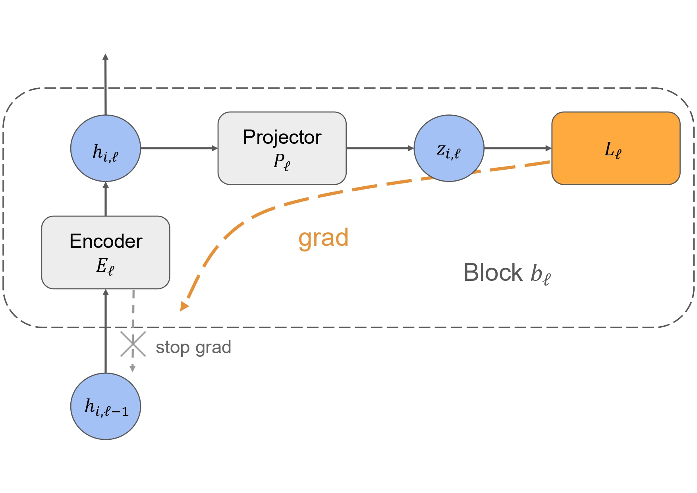

# Summary
<!-- A description of the high-level functionality and purpose of the software for a diverse, non-specialist audience. -->
DecoupleFlow is a `PyTorch`-based package that helps users transform deep learning models into decoupled training architectures. It is designed to simplify the development and deployment of decoupled learning workflows, allowing users to configure model partitioning strategies, training components, and execution parameters through parameterized settings. By reducing the implementation complexity of decoupled learning methods, DecoupleFlow makes these techniques more accessible to researchers and practitioners.

# Statement of need
<!-- A section that clearly illustrates the research purpose of the software and places it in the context of related work. This should clearly state what problems the software is designed to solve, who the target audience is, and its relation to other work. -->
Decoupled architectures are deep learning training methods that partition a model into multiple blocks and reduce gradient dependencies between them, allowing more independent optimization [@jaderberg2017decoupled;@mostafa2018deep]. Such methods have been studied to address limitations of conventional end-to-end backpropagation, including high memory cost and limited parallelism.

Recent work, including Supervised Contrastive Parallel Learning (SCPL)[@Wang2022SCPL;@Ho2023DASCPL] and Decoupled Learning with Information Regularization (DeInfoReg)[@Huang2024DeInfoReg;@huang2025deinforeg], has demonstrated the potential of decoupled learning combined with local representation-based objectives, such as supervised contrastive learning[@khosla2020supervised] and information regularization[@bardes2021vicreg]. However, these methods are often difficult to adopt because they require substantial model refactoring and customized configuration of block partitioning, projection heads, and loss functions.

DecoupleFlow was developed to reduce this implementation burden. It provides a parameterized framework for building decoupled training workflows, making these methods more accessible to researchers and practitioners and supporting reproducible experimentation.

# Statement of field
<!-- A description of how this software compares to other commonly-used packages in the research area. If related tools exist, provide a clear “build vs. contribute” justification explaining your unique scholarly contribution and why existing alternatives are insufficient. -->
DecoupleFlow is inspired by GPipe[@huang2019gpipe] in its use of the pipeline concept, partitioning a model into sequential stages and scheduling execution across devices. Through this partition-and-distribute design, DecoupleFlow can also reduce per-device memory and computation burden, similar to the practical effect of GPipe. Beyond this overlap, DecoupleFlow targets a different objective: it refactors user-defined models into decoupled architectures with block-level components (e.g., projector heads and local objectives), providing a unified implementation approach for decoupled architectures, such as SCPL or DeInfoReg, while retaining flexibility to incorporate future decoupled learning architectures.

# Software design  
<!-- An explanation of the trade-offs you weighed, the design/architecture you chose, and why it matters for your research application. This should demonstrate meaningful design thinking beyond a superficial code structure description. -->
DecoupleFlow adopts a modular, parameterized design for decoupled deep learning training. Instead of requiring users to reimplement a full training pipeline for each method, the package organizes shared components into reusable modules. This architecture reduces implementation overhead and supports rapid construction and modification of decoupled training workflows.

DecoupleFlow transforms a user-defined model into a stack of DecoupleFlow Blocks. Each block contains three core components: an encoder, a projector, and a local loss module. This structure allows each block to optimize a local objective while preserving a training workflow that closely resembles standard model development practice. In typical classification settings, the classifier is placed in the final block; accordingly, the final block does not attach a projector head and is updated with cross-entropy loss. In addition, DecoupleFlow provides an adaptive block variant; compared with the standard block design, each block includes an extra classifier to support early-exit[@tang2023similarity] condition evaluation during inference [@tang2023similarity].


*Figure 1. DecoupleFlow Block containing an encoder, projector head, and local objective loss.*

These components are exposed through a parameterized interface, allowing users to configure decoupled workflows without extensive changes to their existing training code. Key configuration options include:
* `device_map`, which specifies how model blocks are assigned across devices;
* `loss_fn`, which specifies the local loss function;
* `projector_type`, which determines the projector head design;
* `transform_funcs`, which reshapes intermediate representations to avoid dimensional mismatches (e.g., in LSTM-based models); and
* additional parameters for optional features such as multithreaded execution and adaptive inference.

This design provides a common implementation framework for existing decoupled learning methods. In particular, DecoupleFlow modularizes key mechanisms from Supervised Contrastive Parallel Learning (SCPL) and Decoupled Learning with Information Regularization (DeInfoReg), enabling both workflows to be expressed within a unified software structure. As a result, the package improves reproducibility, supports method comparison, and provides a practical basis for extending decoupled learning in future research.

# Research impact statement
<!-- Evidence of realized impact (publications, external use, integrations) or credible near-term significance (benchmarks, reproducible materials, community-readiness signals). The evidence should be compelling and specific, not aspirational. -->
DecoupleFlow modularizes the core mechanisms of SCPL and DeInfoReg. Although the effectiveness of these methods has been established in their original publications[@Wang2022SCPL;@Ho2023DASCPL;@Huang2024DeInfoReg;@huang2025deinforeg], DecoupleFlow focuses on making them easier to implement, reproduce, and extend within a unified software framework. To demonstrate the practical research value of this framework, we evaluated DecoupleFlow under representative large-batch training settings.

On DBpedia with a batch size of 1024, DecoupleFlow-based implementations of SCPL and DeInfoReg achieved competitive predictive performance while improving training efficiency compared with standard backpropagation (BP). Both methods slightly outperformed BP in terms of accuracy and reduced the average epoch training time, demonstrating that DecoupleFlow can support effective and efficient decoupled training in large-batch settings.

| Dataset  | Method              | Accuracy (%)     | Training time (s/epoch) | Speedup |
|----------|---------------------|------------------|--------------------------|---------|
| DBpedia  | BP                  | 98.65 +- 0.14    | 121.31                   | 1.00x   |
| DBpedia  | DecoupleFlow (SCPL) | 98.73 +- 0.03    | 98.63                    | 1.23x   |
| DBpedia  | DecoupleFlow (DeInfoReg) | 98.74 +- 0.05 | 101.94                   | 1.19x   |

# Usage
A typical DecoupleFlow workflow starts from a user-defined PyTorch model and a device mapping that specifies how layers are partitioned across devices. The user can then select the local loss function, projection head type, and optional execution features, such as multithreading or adaptive inference, via parameters.

```python
import torch
import torch.nn as nn
from decoupleflow import DecoupleFlow

# A user-defined backbone model.
backbone = nn.Sequential(
    nn.Linear(768, 512),
    nn.ReLU(),
    nn.Linear(512, 256),
    nn.ReLU(),
    nn.Linear(256, 4),
)

# Partition the model into three blocks and assign them to devices.
device_map = {"cuda:0": 2, "cuda:1": 2, "cuda:2": 1}

model = DecoupleFlow(
    custom_model=backbone,
    device_map=device_map,
    loss_fn="CL",              # or "DeInfo"
    projector_type="i",        # use Identity projector head
    optimizer_fn=torch.optim.Adam,
    optimizer_param={"lr": 1e-3},
    multi_t=True,
    is_adaptive=False,
)

x = torch.randn(32, 768)
y = torch.randint(0, 4, (32,))

features, loss, labels = model.train_step(x, y)
output, labels = model.test_step(x, y)
```
In this example, `device_map` defines block partitioning and device assignment, `loss_fn` selects the local objective, `projector_type` controls the projection head design, and `multi_t` enables multithreaded training.

# AI usage disclosure
<!-- Transparent disclosure of any use of generative AI in the software creation, documentation, or paper authoring. If no AI tools were used, state this explicitly. If AI tools were used, describe how they were used and how the quality and correctness of AI-generated content was verified. -->
Generative AI tools were used as writing and coding assistants in this project. Parts of the package implementation were drafted with AI assistance, while the architecture planning and core methodological ideas were designed by the human authors. The testing code was fully generated by AI, with human authors defining the test goals, reviewing test logic, and validating test coverage and expected behavior. The manuscript text was also generated with AI assistance, and then revised by the human authors, who retained full control over the scientific narrative, claims, and final wording.

# Reference
